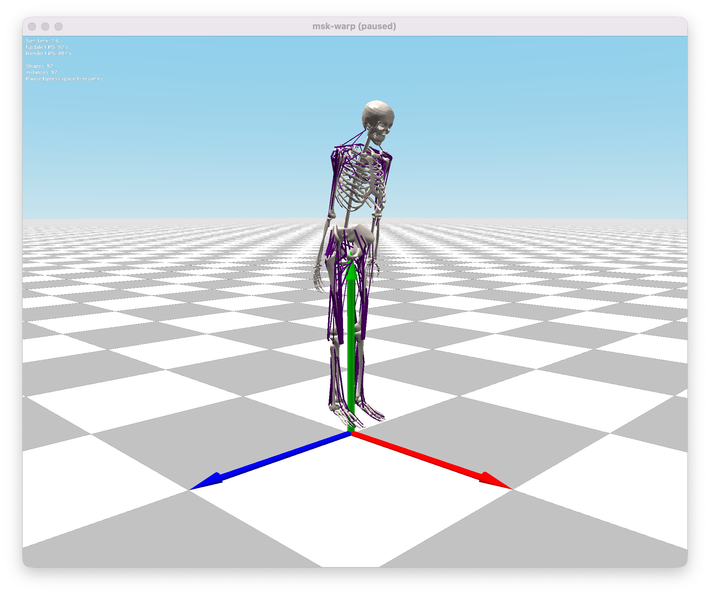

Bolt: GPU-accelerated Musculoskeletal Simulator
============================
GPU-accelerated physics simulations for articulated rigid bodies with muscle actuators, designed for many-world parallel simulations. Inspired by [MuJoCo Warp](https://github.com/google-deepmind/mujoco_warp) and [OpenSim](https://github.com/opensim-org/opensim-core).
<div float="center">
  
</div>

**Current features include:**
- Articulated body motion computations performed in generalized coordinates, including [OpenSim CustomJoint](https://simtk.org/api_docs/opensim/api_docs/classOpenSim_1_1CustomJoint.html) logic.
- Stateful elastic tendon dynamics and muscle activation dynamics
  - Force-curves based on either [Millard et al.](https://doi.org/10.1115/1.4023390) or [De Groote et al.](https://pubmed.ncbi.nlm.nih.gov/27001399/)
  - Includes option to use rigid tendons per muscle
  - Activation dynamics includes Degroote et al. and Millard et al. formulations.
- Geometry-based and polynomial/function-based muscle paths.
- Force-based [Hunt-Crossley contacts](https://simtk.org/api_docs/molmodel/api_docs22/Simbody/html/classSimTK_1_1HuntCrossleyForce.html) and ExponentialContactForces.
- Force-based joint limits:
Exponential joint limits based on [Anderson and Pandy](https://pubmed.ncbi.nlm.nih.gov/11264828/), 
[Hunt-Crossley joint limits](https://simtk.org/api_docs/simbody/api_docs33/Simbody/html/classSimTK_1_1Force_1_1MobilityLinearStop.html), and
[CoordinateLimitForce](https://simtk.org/api_docs/opensim/api_docs/classOpenSim_1_1CoordinateLimitForce.html).
- Symplectic Euler, RK4, adaptive symplectic Euler, and adaptive Runge-Kutta-Merson integrators.
  - Adaptive integrators are error-controlled according to a user-specified accuracy setting

We also include a basic [OpenGL renderer](bolt/render) (not tuned for performance) for debugging.


## Installation
To install Bolt, you'll need to install OpenSim first. We recommend setting up a conda environment first
### 1. Conda Environment Setup
```bash
conda create -n bolt python=3.11
conda activate bolt
```

### 2. Install OpenSim
This section is under construction.

### 3. Install Bolt
```bash
conda create -n bolt python=3.11
conda activate bolt

cd bolt
pip install -r requirements.txt
pip install -e .
```


## Example
The following command will launch a simple renderer with a full-body muscle model.
```bash
python -m bolt.test
```
Command line:
- `--nsteps`    - number of simulation steps to run
- `--nworlds`   - number of parallel simulations
- `--recompile` - forces recompilation of the warp kernels
- `--debug`     - enables debug mode
- `--benchmark` - (GPU only) tests simulator speed

